I wanted to see how far along I've come in my testing journey, so I've been looking at my tester stats. From June 2022 to today (5.25.23), I've done a combined total of 70 surveys, test cases, and bug reports. 

```mermaid
gantt 
    title Current Earnings
    dateFormat X
    axisFormat %s

    section June
    $40 : 0, 40
    section November
    $25 : 0, 25
    section December
    $165 : 0, 165
    section January
    $241 : 0, 241
    section February
    $17 : 0, 17
    section March
    $118 : 0, 118
    section April
    $112 : 0, 112
    section May
    $155 : 0, 155
    section Pending
    $132 : 0, 132
```

The above shows how much I made each month. If you include the pending balance, I just breached $1000. I'm sure it could've been done sooner, but based on things like life, and between some of the tests that I was offered, it's the best that I could come up with. My focus now are projects that have test cases that also allow for exploratory bugs. Some projects want one or the other, and they're very strict about staying inside the lines. However, if a project only requests exploratory bugs, I'm hesistant to do them, not because I'm not interested, but because of the time commitment.

If you get paid per bug and don't find any bugs, or even one small bug (that could range between $1.50-$3.00), then I believe your time is better suited elsewhere.

This has led me to focus on higher paying projects or lower paying projects with short time commitments. One of my favorites is payment testing. Basically, a company needs to test out real credit/debit/PayPal/etc accounts and you offer yours up. Each week they may or may not charge your account. Either way because you were chosen, you submit your test case recording payment activity or lack thereof, and collect your money. They suggest that you maintain at least $200 in the account, but so far I haven't seen a single charge over $1.50. Even when I've had multiple charges, they're refunded right away and haven't been more than $4. 

I also enjoy these type of test cases because they go on for several weeks. If you can take part in multiple, stack them up! On weeks when there aren't any good projects, you're too busy with life, or simply want a break, this'll earn you a Chipotle bowl.

This next month I'll dive deeper into APIs. I'll still be testing on UTest, but I'm more interested in understanding the fundamentals of what it takes to be a great tester. I may even take some time to fiddle with this side. I added [Mermaid](https://mermaid.js.org/intro/) to generate that gantt chart above.